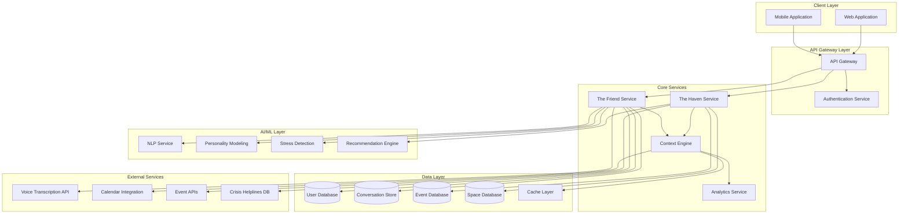

# Design Document: Digital Sanctuary

## Overview

The Digital Sanctuary platform is a comprehensive mental health and social support ecosystem for software professionals. It consists of two primary components: The Friend (AI companion) and The Haven (social discovery hub), integrated through a unified context engine that maintains awareness of the user's emotional state, schedule, and preferences.

The architecture emphasizes privacy-first design, multimodal interaction, and contextual intelligence. The system uses machine learning for personality modeling, stress pattern detection, and recommendation generation, while maintaining strict data security and user control.

### Key Design Principles

1. **Privacy by Design**: All sensitive data encrypted, user maintains full control
2. **Empathy First**: AI responses prioritize emotional validation over problem-solving
3. **Contextual Awareness**: System understands user's day, mood, and circumstances
4. **Progressive Engagement**: Gradually introduces physical community based on readiness
5. **Safety Net**: Crisis detection with immediate resource provision
6. **Multimodal Flexibility**: Support for voice, text, and behavioral pattern analysis

## Architecture

### High-Level System Architecture



### Service Responsibilities

**The Friend Service**
- Manages all AI companion interactions
- Conducts daily check-ins
- Provides empathetic responses
- Detects crisis situations
- Coordinates with NLP and personality modeling

**The Haven Service**
- Curates space recommendations
- Integrates and suggests events
- Manages community connections
- Filters recommendations by energy level

**Context Engine**
- Maintains unified user context
- Tracks engagement patterns
- Calculates energy levels
- Provides context to all services

**Analytics Service**
- Identifies stress patterns
- Tracks personal growth metrics
- Generates insights and visualizations

## Components and Interfaces

### 1. The Friend Service

#### Core Components

**Conversation Manager**
- Handles message routing and context maintenance
- Manages conversation state and history
- Coordinates between text and voice inputs

**Empathy Engine**
- Analyzes emotional content of user messages
- Generates empathetic responses based on personality profile
- Adapts communication style to user preferences

**Check-In Orchestrator**
- Schedules and initiates daily check-ins
- Adapts questions based on user history
- Records responses for pattern analysis

**Crisis Detector**
- Monitors conversations for crisis indicators
- Triggers immediate resource provision
- Escalates to emergency protocols when needed

#### Key Interfaces

```typescript
interface FriendService {
  // Message handling
  sendMessage(userId: string, message: Message): Promise<Response>
  processVoiceNote(userId: string, audioData: AudioData): Promise<Response>
  
  // Check-ins
  initiateCheckIn(userId: string): Promise<CheckIn>
  recordCheckInResponse(userId: string, checkInId: string, response: CheckInResponse): Promise<void>
  
  // Crisis management
  detectCrisis(userId: string, content: string): Promise<CrisisAssessment>
  provideCrisisResources(userId: string): Promise<CrisisResources>
}

interface Message {
  id: string
  userId: string
  content: string
  type: 'text' | 'voice'
  timestamp: Date
  metadata?: MessageMetadata
}

interface Response {
  id: string
  content: string
  emotionalTone: EmotionalTone
  suggestedActions?: Action[]
  timestamp: Date
}

interface CheckIn {
  id: string
  userId: string
  questions: Question[]
  scheduledTime: Date
  adaptedToProfile: boolean
}

interface CheckInResponse {
  checkInId: string
  answers: Answer[]
  detectedMood: Mood
  stressIndicators: string[]
  timestamp: Date
}

interface CrisisAssessment {
  isCrisis: boolean
  severity: 'low' | 'medium' | 'high' | 'critical'
  indicators: string[]
  recommendedAction: CrisisAction
}
```

### 2. The Haven Service

#### Core Components

**Space Curator**
- Manages database of dev-friendly spaces
- Filters spaces by location and attributes
- Ranks spaces based on user preferences and ratings

**Event Integrator**
- Pulls events from external APIs
- Filters events by relevance and user interests
- Manages event metadata and user interactions

**Recommendation Generator**
- Combines energy level, mood, and preferences
- Generates personalized activity suggestions
- Balances variety with user comfort

**Community Connector**
- Facilitates optional peer connections
- Manages anonymous support groups
- Ensures privacy and safety

#### Key Interfaces

```typescript
interface HavenService {
  // Space discovery
  getCuratedSpaces(userId: string, location: Location, filters?: SpaceFilters): Promise<Space[]>
  rateSpace(userId: string, spaceId: string, rating: Rating): Promise<void>
  
  // Event suggestions
  getEventRecommendations(userId: string, filters?: EventFilters): Promise<Event[]>
  expressInterest(userId: string, eventId: string): Promise<void>
  
  // Activity recommendations
  getActivityRecommendations(userId: string): Promise<Activity[]>
  
  // Community features
  findConnections(userId: string, preferences: ConnectionPreferences): Promise<Connection[]>
  joinSupportGroup(userId: string, groupId: string): Promise<void>
}

interface Space {
  id: string
  name: string
  location: Location
  attributes: SpaceAttributes
  ratings: Rating[]
  averageRating: number
  devFriendlyScore: number
}

interface SpaceAttributes {
  wifiQuality: 'excellent' | 'good' | 'fair' | 'poor'
  noiseLevel: 'quiet' | 'moderate' | 'loud'
  powerOutlets: boolean
  seatingCapacity: number
  workFriendly: boolean
}

interface Event {
  id: string
  title: string
  description: string
  location: Location
  startTime: Date
  endTime: Date
  format: 'in-person' | 'virtual' | 'hybrid'
  expectedAttendance: number
  energyRequirement: EnergyLevel
  tags: string[]
}

interface Activity {
  id: string
  type: 'space' | 'event' | 'solo' | 'social'
  title: string
  description: string
  energyRequirement: EnergyLevel
  moodAlignment: Mood[]
  estimatedDuration: number
}
```

### 3. Context Engine

#### Core Components

**User Context Manager**
- Maintains current user state
- Aggregates data from all services
- Provides unified context to requesting services

**Engagement Tracker**
- Records all user interactions
- Identifies engagement patterns
- Detects anomalies in behavior

**Energy Calculator**
- Computes current energy level
- Considers check-in responses, engagement patterns, and time factors
- Updates in real-time as new data arrives

**Schedule Integrator**
- Manages calendar integration
- Understands user's daily schedule
- Provides temporal context

#### Key Interfaces

```typescript
interface ContextEngine {
  // Context retrieval
  getUserContext(userId: string): Promise<UserContext>
  updateContext(userId: string, updates: ContextUpdate): Promise<void>
  
  // Engagement tracking
  recordInteraction(userId: string, interaction: Interaction): Promise<void>
  getEngagementPatterns(userId: string): Promise<EngagementPattern[]>
  
  // Energy calculation
  calculateEnergyLevel(userId: string): Promise<EnergyLevel>
  
  // Schedule management
  integrateCalendar(userId: string, calendarData: CalendarData): Promise<void>
  getCurrentScheduleContext(userId: string): Promise<ScheduleContext>
}

interface UserContext {
  userId: string
  currentMood: Mood
  energyLevel: EnergyLevel
  recentStressors: string[]
  scheduleContext: ScheduleContext
  engagementPatterns: EngagementPattern[]
  personalityProfile: PersonalityProfile
  lastUpdated: Date
}

interface EngagementPattern {
  type: 'daily' | 'weekly' | 'situational'
  description: string
  frequency: number
  typicalTimes: TimeRange[]
  deviationDetected: boolean
}

interface EnergyLevel {
  value: number // 0-100
  category: 'depleted' | 'low' | 'moderate' | 'high' | 'energized'
  confidence: number
  factors: EnergyFactor[]
}

interface ScheduleContext {
  currentActivity?: string
  nextActivity?: ScheduledActivity
  freeTimeAvailable: number // minutes
  busyDay: boolean
}
```

### 4. AI/ML Components

#### NLP Service

**Capabilities**
- Text analysis and sentiment detection
- Voice transcription and vocal characteristic analysis
- Intent recognition
- Entity extraction

**Interface**

```typescript
interface NLPService {
  analyzeText(text: string): Promise<TextAnalysis>
  transcribeVoice(audioData: AudioData): Promise<Transcription>
  analyzeVocalCharacteristics(audioData: AudioData): Promise<VocalAnalysis>
  detectIntent(text: string, context: UserContext): Promise<Intent>
}

interface TextAnalysis {
  sentiment: Sentiment
  emotions: Emotion[]
  topics: string[]
  crisisIndicators: CrisisIndicator[]
  urgency: 'low' | 'medium' | 'high'
}

interface Transcription {
  text: string
  confidence: number
  language: string
  duration: number
}

interface VocalAnalysis {
  pitch: number
  tempo: number
  volume: number
  emotionalIndicators: EmotionalIndicator[]
  stressMarkers: string[]
}
```

#### Personality Modeling Service

**Capabilities**
- Builds user personality profile during onboarding
- Updates profile based on ongoing interactions
- Provides personality-based response recommendations

**Model Structure**

```typescript
interface PersonalityProfile {
  userId: string
  communicationStyle: CommunicationStyle
  socialPreferences: SocialPreferences
  stressResponses: StressResponse[]
  interests: string[]
  boundaries: Boundary[]
  preferredInteractionTimes: TimeRange[]
  createdAt: Date
  lastUpdated: Date
}

interface CommunicationStyle {
  formality: 'casual' | 'moderate' | 'formal'
  verbosity: 'concise' | 'balanced' | 'detailed'
  emotionalExpressiveness: 'reserved' | 'moderate' | 'expressive'
  preferredMode: 'text' | 'voice' | 'mixed'
}

interface SocialPreferences {
  groupSize: 'one-on-one' | 'small-group' | 'large-group' | 'flexible'
  activityType: 'structured' | 'casual' | 'mixed'
  introversion: number // 0-100 scale
  comfortWithNewPeople: number // 0-100 scale
}
```

#### Stress Detection Service

**Capabilities**
- Analyzes check-in responses for stress indicators
- Identifies patterns across time
- Predicts high-stress periods
- Generates alerts for concerning trends

**Interface**

```typescript
interface StressDetectionService {
  analyzeCheckIn(checkInResponse: CheckInResponse): Promise<StressAssessment>
  identifyPatterns(userId: string, timeRange: TimeRange): Promise<StressPattern[]>
  predictHighStressPeriods(userId: string): Promise<StressPrediction[]>
}

interface StressAssessment {
  level: number // 0-100
  category: 'minimal' | 'mild' | 'moderate' | 'high' | 'severe'
  indicators: StressIndicator[]
  recommendedActions: Action[]
}

interface StressPattern {
  type: 'temporal' | 'situational' | 'chronic'
  description: string
  frequency: number
  triggers: string[]
  firstDetected: Date
  lastOccurrence: Date
}
```

#### Recommendation Engine

**Capabilities**
- Generates personalized activity recommendations
- Filters by energy level, mood, and context
- Learns from user feedback
- Balances exploration and exploitation

**Algorithm Approach**

The recommendation engine uses a hybrid approach:

1. **Content-Based Filtering**: Matches activities to user's personality profile and current mood
2. **Collaborative Filtering**: Learns from similar users' preferences
3. **Contextual Bandits**: Balances exploration of new activities with exploitation of known preferences
4. **Energy-Aware Filtering**: Hard constraint on energy requirements

**Interface**

```typescript
interface RecommendationEngine {
  generateRecommendations(userId: string, context: UserContext, count: number): Promise<Recommendation[]>
  recordFeedback(userId: string, recommendationId: string, feedback: Feedback): Promise<void>
  explainRecommendation(recommendationId: string): Promise<Explanation>
}

interface Recommendation {
  id: string
  item: Activity | Event | Space
  score: number
  reasoning: string[]
  energyMatch: boolean
  moodMatch: boolean
  novelty: number // 0-1, how new this type of recommendation is
}
```

## Data Models

### User Profile

```typescript
interface User {
  id: string
  email: string
  passwordHash: string
  createdAt: Date
  lastActive: Date
  
  // Profile information
  personalityProfile: PersonalityProfile
  preferences: UserPreferences
  location: Location
  timezone: string
  
  // Privacy settings
  privacySettings: PrivacySettings
  consentGiven: Consent[]
  
  // Integration
  calendarConnected: boolean
  calendarProvider?: string
  
  // Status
  accountStatus: 'active' | 'suspended' | 'deleted'
  subscriptionTier: 'free' | 'premium'
}

interface UserPreferences {
  notificationSettings: NotificationSettings
  doNotDisturbPeriods: TimeRange[]
  communityFeaturesEnabled: boolean
  dataRetentionPreference: 'minimal' | 'standard' | 'extended'
}

interface PrivacySettings {
  shareDataForResearch: boolean
  allowAnonymousMatching: boolean
  visibleToOtherUsers: boolean
  dataEncryptionLevel: 'standard' | 'enhanced'
}
```

### Conversation Data

```typescript
interface Conversation {
  id: string
  userId: string
  startedAt: Date
  lastMessageAt: Date
  messages: Message[]
  context: ConversationContext
  status: 'active' | 'archived'
}

interface ConversationContext {
  topic: string
  emotionalArc: EmotionalState[]
  keyThemes: string[]
  crisisDetected: boolean
  followUpRequired: boolean
}

interface Message {
  id: string
  conversationId: string
  sender: 'user' | 'friend'
  content: string
  type: 'text' | 'voice'
  timestamp: Date
  metadata: MessageMetadata
}

interface MessageMetadata {
  sentiment?: Sentiment
  emotions?: Emotion[]
  voiceCharacteristics?: VocalAnalysis
  crisisIndicators?: CrisisIndicator[]
}
```

### Check-In Data

```typescript
interface CheckInRecord {
  id: string
  userId: string
  scheduledTime: Date
  completedTime?: Date
  status: 'pending' | 'completed' | 'skipped' | 'missed'
  
  questions: Question[]
  responses: Answer[]
  
  // Analysis results
  detectedMood: Mood
  stressLevel: number
  energyLevel: number
  stressIndicators: string[]
  
  // Follow-up
  followUpActions: Action[]
  friendResponse: string
}

interface Question {
  id: string
  text: string
  type: 'scale' | 'multiple-choice' | 'open-ended'
  adaptedFromProfile: boolean
}

interface Answer {
  questionId: string
  value: string | number
  timestamp: Date
}
```

### Space and Event Data

```typescript
interface Space {
  id: string
  name: string
  description: string
  location: Location
  attributes: SpaceAttributes
  
  // Community data
  addedBy: string
  verifiedBy?: string
  ratings: Rating[]
  reviews: Review[]
  
  // Metadata
  createdAt: Date
  lastUpdated: Date
  visitCount: number
}

interface Event {
  id: string
  externalId?: string
  source: 'manual' | 'meetup' | 'eventbrite' | 'other'
  
  title: string
  description: string
  organizer: string
  location: Location
  
  startTime: Date
  endTime: Date
  format: 'in-person' | 'virtual' | 'hybrid'
  
  // Categorization
  tags: string[]
  category: string
  targetAudience: string[]
  
  // Metadata
  expectedAttendance: number
  energyRequirement: EnergyLevel
  registrationRequired: boolean
  registrationUrl?: string
  
  // Tracking
  interestedUsers: string[]
  attendedUsers: string[]
}

interface Rating {
  userId: string
  value: number // 1-5
  timestamp: Date
}

interface Review {
  userId: string
  rating: number
  text: string
  helpful: number
  timestamp: Date
}
```

### Analytics Data

```typescript
interface StressPattern {
  id: string
  userId: string
  type: 'temporal' | 'situational' | 'chronic'
  
  description: string
  triggers: string[]
  frequency: number
  
  // Temporal information
  timeOfDay?: TimeRange
  dayOfWeek?: number[]
  seasonal?: string
  
  // Detection
  firstDetected: Date
  lastOccurrence: Date
  confidence: number
  
  // Impact
  severity: 'mild' | 'moderate' | 'severe'
  affectedAreas: string[]
}

interface GrowthMetric {
  userId: string
  metricType: 'mood' | 'stress' | 'social-engagement' | 'energy'
  
  timeRange: TimeRange
  dataPoints: DataPoint[]
  
  trend: 'improving' | 'stable' | 'declining'
  trendConfidence: number
  
  insights: string[]
  milestones: Milestone[]
}

interface DataPoint {
  timestamp: Date
  value: number
  context?: string
}

interface Milestone {
  date: Date
  description: string
  type: 'achievement' | 'setback' | 'insight'
}
```

## Correctness Properties

*A property is a characteristic or behavior that should hold true across all valid executions of a system—essentially, a formal statement about what the system should do. Properties serve as the bridge between human-readable specifications and machine-verifiable correctness guarantees.*


### Property Reflection

After analyzing all acceptance criteria, several redundancies were identified:

**Redundancies Identified:**
1. Requirements 8.2, 8.3, and 10.3 all test energy-based event filtering - can be combined into one comprehensive property
2. Requirements 18.2, 18.3, 18.4, and 18.5 all test mood-based filtering - can be combined into one property with multiple mood cases
3. Requirements 7.4 and 7.5 test context-based suggestions - can be combined with mood-based filtering
4. Requirements 9.3 and 10.4 both test data completeness for different entity types - similar pattern
5. Requirements 12.1 and 12.2 both test encryption - can be combined into one comprehensive encryption property

**Properties to Combine:**
- Energy-based filtering (8.2, 8.3, 10.3) → Single property: "Energy level determines event intensity"
- Mood-based filtering (18.2, 18.3, 18.4, 18.5) → Single property: "Mood determines activity type"
- Context-based suggestions (7.4, 7.5) → Merged with mood-based filtering
- Data encryption (12.1, 12.2) → Single property: "Data is encrypted at rest and in transit"

### Correctness Properties

#### Onboarding and Profile Management

**Property 1: New user onboarding initiation**
*For any* user without an existing personality profile, when they first access the platform, the system should initiate the onboarding process.
**Validates: Requirements 1.1**

**Property 2: Onboarding profile generation**
*For any* completed personality assessment, the system should generate a personality profile containing communication style preferences, stress indicators, and social preferences.
**Validates: Requirements 1.3, 1.5**

**Property 3: Profile persistence round-trip**
*For any* generated personality profile, storing it and then retrieving it should produce an equivalent profile.
**Validates: Requirements 1.4**

#### Check-Ins and Mental Health Monitoring

**Property 4: Daily check-in initiation**
*For any* user, when a new day begins in their timezone, the system should initiate a check-in.
**Validates: Requirements 2.1**

**Property 5: Personalized check-in questions**
*For any* two users with different personality profiles, the check-in questions generated for them should differ based on their profile attributes.
**Validates: Requirements 2.2**

**Property 6: Check-in response analysis**
*For any* check-in response, the system should analyze it and produce a stress assessment.
**Validates: Requirements 2.3**

**Property 7: Stress-triggered support**
*For any* check-in response with detected stress indicators above a threshold, the Friend should offer support or resources in the response.
**Validates: Requirements 2.4**

**Property 8: Check-in persistence**
*For any* completed check-in, the system should store the user's reported state and it should be retrievable for pattern analysis.
**Validates: Requirements 2.5**

#### Empathetic Interaction

**Property 9: Emotional acknowledgment**
*For any* user message containing emotional content (detected by NLP), the Friend's response should acknowledge the emotional content.
**Validates: Requirements 3.1**

**Property 10: Personality-adapted responses**
*For any* two users with different communication style preferences, the Friend's response style to similar messages should differ according to their preferences.
**Validates: Requirements 3.4**

**Property 11: Conversation theme storage**
*For any* completed conversation, the system should extract and store key themes that are retrievable for future context.
**Validates: Requirements 3.5**

#### Stress Pattern Detection

**Property 12: Stress pattern identification**
*For any* sequence of check-in responses containing recurring stress indicators, the system should identify and store the stress pattern.
**Validates: Requirements 4.1, 4.2**

**Property 13: Pattern-based proactive support**
*For any* user with a known stress pattern, when current interactions match that pattern, the Friend should offer relevant coping strategies.
**Validates: Requirements 4.3**

**Property 14: Temporal stress pattern detection**
*For any* sequence of check-ins with stress concentrated at specific times of day or days of week, the system should identify the temporal pattern.
**Validates: Requirements 4.4**

**Property 15: Significant pattern notification**
*For any* stress pattern that exceeds significance thresholds (frequency, severity), the system should generate a notification with insights for the user.
**Validates: Requirements 4.5**

#### Multimodal Interaction

**Property 16: Voice transcription**
*For any* voice note, the system should produce a text transcription.
**Validates: Requirements 5.1**

**Property 17: Dual voice analysis**
*For any* transcribed voice note, the system should analyze both the text content and vocal characteristics.
**Validates: Requirements 5.2**

**Property 18: Distress-adapted response**
*For any* voice note with vocal characteristics indicating distress, the Friend's response should have an adjusted emotional tone compared to non-distressed messages.
**Validates: Requirements 5.3**

**Property 19: Text interaction support**
*For any* text message sent to the Friend, the system should process it and generate a response.
**Validates: Requirements 5.4**

**Property 20: Cross-modal context preservation**
*For any* conversation, switching between voice and text modes should maintain conversation context (previous messages remain accessible).
**Validates: Requirements 5.5**

**Property 21: Multi-modal engagement tracking**
*For any* user with both voice and text interactions, the system should detect engagement patterns across both modes.
**Validates: Requirements 5.6**

#### Engagement Pattern Analysis

**Property 22: Interaction logging**
*For any* user interaction with the platform, the system should record it with timestamp and interaction type.
**Validates: Requirements 6.1**

**Property 23: Engagement pattern identification**
*For any* user with sufficient interaction history, the system should identify typical engagement patterns (daily, weekly, or situational).
**Validates: Requirements 6.2**

**Property 24: Engagement anomaly detection**
*For any* user with established engagement patterns, when their behavior deviates significantly, the system should flag it as a potential concern.
**Validates: Requirements 6.3**

**Property 25: Engagement-based energy inference**
*For any* user, their calculated energy level should be influenced by their engagement patterns.
**Validates: Requirements 6.4**

**Property 26: Withdrawal-triggered outreach**
*For any* user whose engagement patterns indicate withdrawal or isolation, the Friend should proactively initiate contact.
**Validates: Requirements 6.5**

#### Contextual Intelligence

**Property 27: Context extraction and storage**
*For any* user message containing contextual information about their day, the system should extract and store relevant context that is retrievable.
**Validates: Requirements 7.1**

**Property 28: Schedule awareness**
*For any* user who provides schedule information, the system should maintain it and make it available for context queries.
**Validates: Requirements 7.2**

**Property 29: Time-aware suggestions**
*For any* two suggestion requests at different times of day or days of week, the suggestions should differ based on temporal context.
**Validates: Requirements 7.3**

**Property 30: Mood and context-based activity filtering**
*For any* user with a specific mood state (anxious, energized, sad) or context (high stress, available), activity recommendations should be filtered to match: anxious→calming, energized→engaging, sad→comforting/uplifting, high-stress→calming, available→social.
**Validates: Requirements 7.4, 7.5, 18.2, 18.3, 18.4, 18.5**

#### Energy-Based Recommendations

**Property 31: Energy level calculation before recommendations**
*For any* event recommendation request, the system should calculate the user's current energy level as part of the recommendation process.
**Validates: Requirements 8.1**

**Property 32: Energy-based event intensity filtering**
*For any* user, event recommendations should match their energy level: low energy→low-intensity events, high energy→includes high-intensity events.
**Validates: Requirements 8.2, 8.3, 10.3**

**Property 33: Multi-source energy calculation**
*For any* user, the calculated energy level should be influenced by all three sources: check-in responses, engagement patterns, and explicit user input.
**Validates: Requirements 8.4**

**Property 34: Event energy requirement disclosure**
*For any* event recommendation, the system should include the expected energy requirement in the recommendation data.
**Validates: Requirements 8.5**

#### Space Discovery

**Property 35: Space recommendation generation**
*For any* space recommendation request, the system should return a list of curated spaces.
**Validates: Requirements 9.1**

**Property 36: Location-based space filtering**
*For any* two users at different locations, their space recommendations should differ based on proximity to their respective locations.
**Validates: Requirements 9.2**

**Property 37: Space attribute completeness**
*For any* curated space, it should include all required attributes: WiFi quality, noise level, power outlets, and seating information.
**Validates: Requirements 9.3**

**Property 38: Space rating persistence**
*For any* space rating submitted by a user, it should be stored and associated with the space, and retrievable in future space queries.
**Validates: Requirements 9.4**

**Property 39: Space ranking by preferences and ratings**
*For any* set of spaces matching criteria, they should be ranked with higher-rated spaces and preference-matching spaces appearing earlier in the list.
**Validates: Requirements 9.5**

#### Event Integration

**Property 40: Event integration**
*For any* external event in a user's area, the system should import and store it in the platform.
**Validates: Requirements 10.1**

**Property 41: Interest-based event filtering**
*For any* two users with different interests in their personality profiles, their event recommendations should differ based on interest alignment.
**Validates: Requirements 10.2**

**Property 42: Event detail completeness**
*For any* event, it should include all required details: time, location, format, and expected attendance.
**Validates: Requirements 10.4**

**Property 43: Event interest tracking**
*For any* user expressing interest in an event, the system should provide save or RSVP options and record the interest.
**Validates: Requirements 10.5**

#### Physical Community Bridging

**Property 44: Readiness-based physical suggestions**
*For any* user showing readiness indicators for in-person interaction, the Haven should include physical events or spaces in recommendations.
**Validates: Requirements 11.1**

**Property 45: Escape route provision**
*For any* physical activity suggestion, the system should include low-commitment options or "escape route" information.
**Validates: Requirements 11.3**

**Property 46: Boundary enforcement**
*For any* user with set boundaries for physical interactions, recommendations should respect those boundaries (no suggestions that violate boundaries).
**Validates: Requirements 11.4**

**Property 47: Post-event follow-up**
*For any* user who attends a physical event, the system should initiate a follow-up interaction to gather experience feedback.
**Validates: Requirements 11.5**

#### Privacy and Security

**Property 48: Data encryption**
*For any* personal or mental health information, it should be encrypted both at rest (in database) and in transit (during API calls).
**Validates: Requirements 12.1, 12.2**

**Property 49: Third-party data sharing restriction**
*For any* user mental health data, it should not be sent to third-party services unless the user has explicit consent flags set.
**Validates: Requirements 12.3**

**Property 50: Data export completeness**
*For any* user data export request, the system should generate a complete export containing all user data within 48 hours.
**Validates: Requirements 12.4**

**Property 51: Data deletion completeness**
*For any* user data deletion request, all personal data should be permanently removed from the system within 30 days.
**Validates: Requirements 12.5**

#### Crisis Management

**Property 52: Crisis indicator detection**
*For any* user message containing crisis keywords or patterns (self-harm, severe depression, suicidal ideation), the system should detect and flag them.
**Validates: Requirements 13.1**

**Property 53: Crisis resource provision**
*For any* detected crisis situation, the Friend should immediately provide crisis helpline resources in the response.
**Validates: Requirements 13.2**

**Property 54: Crisis mode prioritization**
*For any* user in crisis mode, the system should override normal interaction patterns and prioritize safety-focused responses.
**Validates: Requirements 13.3**

**Property 55: Crisis resource completeness**
*For any* crisis resource provided, it should include contact information for mental health professionals and emergency services.
**Validates: Requirements 13.4**

#### Growth Tracking

**Property 56: Historical insight generation**
*For any* user with sufficient historical check-in data, the system should generate insights about mental health trends.
**Validates: Requirements 14.1**

**Property 57: Pattern visualization data**
*For any* user, the system should generate visualization data for mood, stress, and social engagement patterns over time.
**Validates: Requirements 14.2**

**Property 58: Positive trend acknowledgment**
*For any* user with identified positive trends in mental health metrics, the Friend should acknowledge and celebrate the progress.
**Validates: Requirements 14.3**

**Property 59: Concerning trend intervention**
*For any* user with identified concerning trends, the Friend should suggest interventions or resources.
**Validates: Requirements 14.4**

**Property 60: Historical data access**
*For any* user, they should be able to retrieve their historical check-in responses and identified patterns.
**Validates: Requirements 14.5**

#### Adaptive Timing

**Property 61: Preference-based timing**
*For any* Friend-initiated contact, the timing should fall within the user's stated preference windows.
**Validates: Requirements 15.1**

**Property 62: Adaptive timing from ignored check-ins**
*For any* user who consistently ignores check-ins at certain times, the system should adjust check-in timing away from those times.
**Validates: Requirements 15.3**

**Property 63: Do not disturb enforcement**
*For any* user with set "do not disturb" periods, the system should not initiate contact during those periods (except emergencies).
**Validates: Requirements 15.4**

**Property 64: Emergency timing override**
*For any* urgent support situation with user consent, the system should be able to override timing preferences.
**Validates: Requirements 15.5**

#### Community Features

**Property 65: Interest-based connection suggestions**
*For any* user who opts into community features, connection suggestions should be based on shared interests from personality profiles.
**Validates: Requirements 16.1**

**Property 66: Anonymous support group access**
*For any* user who opts into community features, the system should provide access to anonymous peer support groups.
**Validates: Requirements 16.2**

**Property 67: Mental health data privacy in community**
*For any* user's mental health information, it should not be revealed to other users without explicit permission.
**Validates: Requirements 16.3**

**Property 68: Safe connection matching**
*For any* connection suggestion, it should meet safety and compatibility criteria before being suggested.
**Validates: Requirements 16.4**

**Property 69: Community opt-out**
*For any* user who opts out of community features, all community-related functionality should be disabled for them.
**Validates: Requirements 16.5**

#### Calendar Integration

**Property 70: Calendar import**
*For any* user who grants calendar access, the system should import and store their schedule information.
**Validates: Requirements 17.1**

**Property 71: Schedule-aware check-in adaptation**
*For any* user with a busy day scheduled, check-in timing and content should be adjusted compared to free days.
**Validates: Requirements 17.2**

**Property 72: Time-appropriate activity suggestions**
*For any* user with free time in their schedule, activity suggestions should fit within the available time duration.
**Validates: Requirements 17.3**

**Property 73: Calendar privacy enforcement**
*For any* user with calendar integration, calendar event details should not be exposed in Friend responses or to other users.
**Validates: Requirements 17.4**

**Property 74: Calendar access revocation**
*For any* user who revokes calendar access, the system should stop using schedule information for suggestions and timing.
**Validates: Requirements 17.5**

#### Mood-Based Recommendations

**Property 75: Mood state persistence**
*For any* check-in or interaction where mood is determined, the system should store the current mood state and it should be retrievable.
**Validates: Requirements 18.1**

#### Offline Functionality

**Property 76: Offline journaling**
*For any* user in offline mode, text-based journaling should function and entries should be stored locally.
**Validates: Requirements 19.1**

**Property 77: Offline voice note queuing**
*For any* voice note recorded while offline, it should be queued for processing when connectivity is restored.
**Validates: Requirements 19.2**

**Property 78: Offline interaction sync**
*For any* interactions created while offline, when connectivity is restored, they should be synced to the server.
**Validates: Requirements 19.3**

**Property 79: Offline resource access**
*For any* user in offline mode, cached coping resources and previous Friend responses should be accessible.
**Validates: Requirements 19.4**

**Property 80: Connectivity requirement notification**
*For any* online-only feature attempted while offline, the user should receive a notification that connectivity is required.
**Validates: Requirements 19.5**

#### Accessibility

**Property 81: Audio text alternatives**
*For any* audio content in the system, a text alternative should be provided.
**Validates: Requirements 20.2**

**Property 82: Voice input support**
*For any* text input field, voice input should be supported as an alternative input method.
**Validates: Requirements 20.3**

**Property 83: UI customization**
*For any* user, font size and contrast adjustment settings should be available and should affect the displayed UI.
**Validates: Requirements 20.4**

## Error Handling

### Error Categories

**1. User Input Errors**
- Invalid or malformed data in messages
- Missing required fields in API requests
- Out-of-range values (e.g., invalid ratings)

**Handling Strategy:**
- Validate all inputs at API gateway
- Return clear error messages with guidance
- Log validation failures for pattern analysis
- Never expose internal system details

**2. External Service Failures**
- Voice transcription API unavailable
- Calendar API connection failures
- Event API timeouts

**Handling Strategy:**
- Implement retry logic with exponential backoff
- Provide graceful degradation (e.g., text-only mode if voice fails)
- Cache external data when possible
- Notify users when features are temporarily unavailable

**3. Data Consistency Errors**
- Profile data corruption
- Missing required context
- Inconsistent state across services

**Handling Strategy:**
- Use database transactions for multi-step operations
- Implement data validation at storage layer
- Provide default values for missing optional data
- Log inconsistencies for investigation

**4. Crisis Situations**
- Crisis detection false positives
- Crisis detection false negatives
- Resource provision failures

**Handling Strategy:**
- Err on the side of caution (prefer false positives)
- Always provide crisis resources when in doubt
- Have fallback resource lists if external services fail
- Log all crisis detections for review

**5. Privacy and Security Errors**
- Unauthorized access attempts
- Encryption failures
- Data leak attempts

**Handling Strategy:**
- Fail closed (deny access on errors)
- Log all security events
- Alert administrators immediately
- Provide generic error messages to users

### Error Response Format

```typescript
interface ErrorResponse {
  error: {
    code: string
    message: string
    userMessage: string
    timestamp: Date
    requestId: string
    details?: any
  }
}

// Example error codes
enum ErrorCode {
  VALIDATION_ERROR = 'VALIDATION_ERROR',
  UNAUTHORIZED = 'UNAUTHORIZED',
  NOT_FOUND = 'NOT_FOUND',
  EXTERNAL_SERVICE_ERROR = 'EXTERNAL_SERVICE_ERROR',
  CRISIS_DETECTED = 'CRISIS_DETECTED',
  RATE_LIMIT_EXCEEDED = 'RATE_LIMIT_EXCEEDED',
  INTERNAL_ERROR = 'INTERNAL_ERROR'
}
```

### Retry and Resilience Patterns

**Circuit Breaker Pattern:**
- Applied to all external service calls
- Opens after 5 consecutive failures
- Half-open state after 30 seconds
- Closes after 3 successful calls

**Timeout Configuration:**
- API Gateway: 30 seconds
- Friend Service: 10 seconds
- Haven Service: 10 seconds
- NLP Service: 15 seconds
- External APIs: 5 seconds

**Rate Limiting:**
- Per user: 100 requests per minute
- Per IP: 1000 requests per minute
- Crisis endpoints: No rate limiting

## Testing Strategy

### Dual Testing Approach

The Digital Sanctuary platform requires both unit testing and property-based testing to ensure comprehensive coverage:

**Unit Tests** focus on:
- Specific examples of correct behavior
- Edge cases (empty inputs, boundary values, special characters)
- Error conditions and exception handling
- Integration points between services
- Crisis detection with specific phrases
- Accessibility features with assistive technologies

**Property-Based Tests** focus on:
- Universal properties that hold for all inputs
- Comprehensive input coverage through randomization
- Invariants that must be maintained
- Round-trip properties (serialization, encryption)
- Relationship properties between components

Both approaches are complementary and necessary. Unit tests catch concrete bugs and verify specific scenarios, while property tests verify general correctness across a wide input space.

### Property-Based Testing Configuration

**Testing Library:** We will use a property-based testing library appropriate for the chosen implementation language:
- Python: Hypothesis
- TypeScript/JavaScript: fast-check
- Java: jqwik
- Go: gopter

**Test Configuration:**
- Minimum 100 iterations per property test (due to randomization)
- Configurable seed for reproducibility
- Shrinking enabled to find minimal failing examples

**Property Test Tagging:**
Each property-based test must reference its design document property using this format:

```
// Feature: digital-sanctuary, Property 1: New user onboarding initiation
// For any user without an existing personality profile, when they first access
// the platform, the system should initiate the onboarding process.
```

### Test Coverage Requirements

**Critical Paths (100% coverage required):**
- Crisis detection and resource provision
- Data encryption and privacy enforcement
- Check-in scheduling and execution
- User authentication and authorization

**High Priority (90% coverage required):**
- Personality modeling and adaptation
- Stress pattern detection
- Energy level calculation
- Recommendation generation

**Standard Priority (80% coverage required):**
- Space and event discovery
- Community features
- Calendar integration
- Offline functionality

### Testing Environments

**Unit and Property Tests:**
- Run in CI/CD pipeline on every commit
- Use in-memory databases for speed
- Mock external services
- Isolated test data per test

**Integration Tests:**
- Run in staging environment
- Use test databases with realistic data
- Connect to test instances of external services
- Shared test data with cleanup between runs

**End-to-End Tests:**
- Run in staging environment before production deployment
- Test complete user journeys
- Verify cross-service communication
- Include accessibility testing with screen readers

### Monitoring and Observability

**Metrics to Track:**
- API response times (p50, p95, p99)
- Error rates by endpoint and error type
- Crisis detection rate and false positive rate
- User engagement metrics
- Recommendation acceptance rate
- Check-in completion rate

**Logging Strategy:**
- Structured logging with correlation IDs
- Log levels: DEBUG, INFO, WARN, ERROR, CRITICAL
- Sensitive data redaction in logs
- Centralized log aggregation

**Alerting:**
- Crisis detection failures → Immediate alert
- API error rate > 5% → Alert within 5 minutes
- External service failures → Alert within 2 minutes
- Data encryption failures → Immediate alert
- Unusual user behavior patterns → Daily digest

### Security Testing

**Regular Security Audits:**
- Penetration testing quarterly
- Dependency vulnerability scanning weekly
- Code security analysis in CI/CD
- Privacy compliance audits annually

**Specific Security Tests:**
- SQL injection prevention
- XSS prevention
- CSRF protection
- Authentication bypass attempts
- Authorization boundary testing
- Data leak prevention
- Encryption verification
