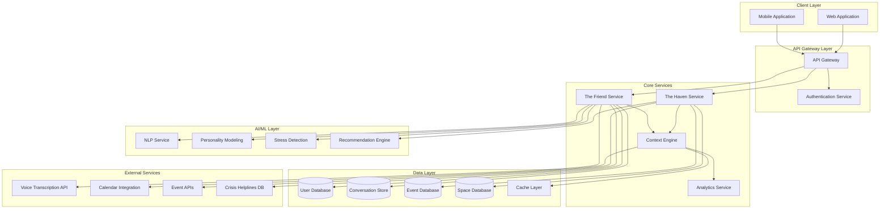

# Design Document: ReflectAI

## Overview

The ReflectAI platform is a comprehensive mental health and social support ecosystem for software professionals. It consists of two primary components: The Friend (AI companion) and The Haven (social discovery hub), integrated through a unified context engine that maintains awareness of the user's emotional state, schedule, and preferences.

The architecture emphasizes privacy-first design, multimodal interaction, and contextual intelligence. The system uses machine learning for personality modeling, stress pattern detection, and recommendation generation, while maintaining strict data security and user control.

### Key Design Principles

1. **Privacy by Design**: All sensitive data encrypted, user maintains full control
2. **Empathy First**: AI responses prioritize emotional validation over problem-solving
3. **Contextual Awareness**: System understands user's day, mood, and circumstances
4. **Progressive Engagement**: Gradually introduces physical community based on readiness
5. **Safety Net**: Crisis detection with immediate resource provision
6. **Multimodal Flexibility**: Support for voice, text, and behavioral pattern analysis

## Architecture

### High-Level System Architecture

